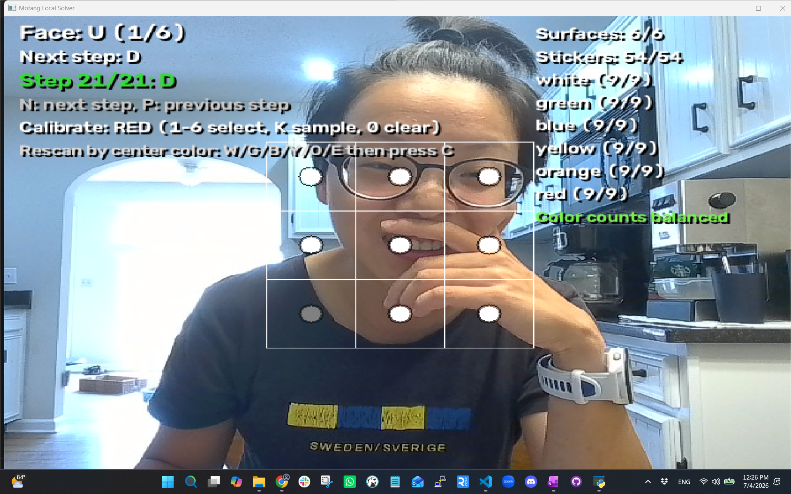

# Mofang - Rubik's Cube Solver via Computer Vision

Scan a physical Rubik's cube with a webcam, solve it, and watch the
step-by-step solution locally with OpenCV overlays and move notations.



## Live demo

https://youtu.be/cVteUWCLpQ0?si=NTWkGIBiKTLFtgRl

## Project structure

- `cube_solver/python_app/` -- OpenCV webcam scanner + color detection +
  Kociemba solver.

## Architecture flow

Webcam -> scanner -> color detect -> cube state -> Kociemba -> move overlay.

## Solver algs

| Algorithm | Strategy | Speed | Best for |
| --- | --- | --- | --- |
| **Kociemba (Two‑Phase)** | Uses group theory to reduce cube to a restricted subgroup (G1), then solves | Very fast | Real‑time solvers and practical near‑optimal solutions |

## Run the local OpenCV solver

### 1) Install Python dependencies

From the repository root:

```powershell
python -m pip install -r cube_solver/python_app/requirements.txt
```

### 2) Start local scanner + solver

From the repository root, run:

```powershell
python -m cube_solver.python_app.main
```

Controls in the OpenCV window:

- `C` capture current face (order: U R F D L B)
- `W/G/B/Y/O/E` select a previously scanned face by center color (white/green/blue/yellow/orange/red), then press `C` to rescan only that face
- `S` solve after all faces are captured
- `N` next solution step
- `P` previous solution step
- `R` reset scan
- `1..6` choose calibration color (`white, red, green, yellow, orange, blue`)
- `K` sample center sticker and save calibration
- `0` clear calibration profile
- `Q` quit

The terminal prints the full notation sequence (for example `R U R' U'`) and
the window shows one move at a time.

Live scan validation shown on-screen:

- `Surfaces: x/6`
- `Stickers: x/54`
- Per-color sticker totals: `white/green/blue/yellow/orange/red (x/9)`
- If counts are off after 6/6 faces, the overlay shows `Re-scan needed` with:
  - `Missing: color+N`
  - `Extra: color-N`

Targeted rescan workflow:

1. Finish at least one scan of the face you want to replace.
2. Press the center-color key (`W/G/B/Y/O/E`) for that face.
3. Align that face in the grid.
4. Press `C` to overwrite only that face scan.

Calibration tip:

- For red, sample under neutral lighting and press `K` 2-3 times to average noise.
- Keep the center sticker fully inside the guide box while calibrating.
- The app assumes the standard Rubik's Cube orientation: U white, R red, F green, D yellow, L orange, B blue.

